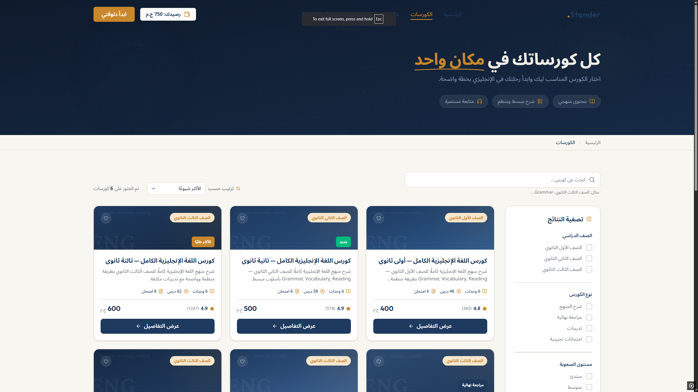
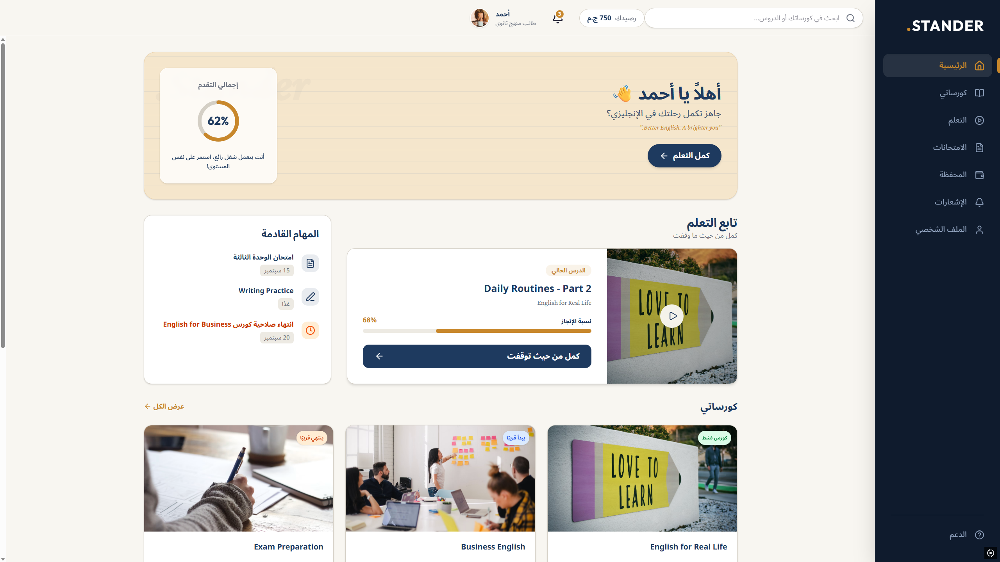

# Edu Stander - Educational Platform

## Overview (نظرة عامة)
**Edu Stander** is a comprehensive educational platform built with React and Vite. It serves as a hub for both public users and students, providing a seamless learning experience. The platform is designed to connect teachers with students, offering structured courses, detailed learning materials, exams, and a built-in wallet system.

**Edu Stander** عبارة عن منصة تعليمية متكاملة مبنية باستخدام React و Vite. بتوفر بيئة تعليمية متكاملة للطلاب وللزوار، وبتوصل المدرسين بالطلاب من خلال كورسات منظمة، مواد علمية، امتحانات، ومحفظة إلكترونية مدمجة للمدفوعات.

## Key Features (أهم المميزات)
- 🎓 **Student Dashboard**: A personalized dashboard for students to track their progress, view enrolled courses, and manage their learning journey. (لوحة تحكم خاصة بالطالب لمتابعة مستواه وكورساته).
- 📚 **Courses & Learning**: Browse available courses, view detailed curriculum, and interact with an advanced video player for lessons. (تصفح الكورسات ومشاهدة الفيديوهات التعليمية).
- 📝 **Exams & Homework**: Built-in exam system with instant results and homework submissions. (نظام امتحانات وواجبات مدمج).
- 💳 **Wallet System**: Students can manage their balance, view transaction history, and top up for course purchases. (محفظة إلكترونية للطلاب لشحن الرصيد وشراء الكورسات).
- 🔔 **Notifications**: Keep users updated with important announcements and progress alerts. (نظام إشعارات وتنبيهات).
- 📱 **Responsive Design**: Fully optimized for mobile, tablet, and desktop viewing. (تصميم متجاوب مع كل الأجهزة).

## Tech Stack (التقنيات المستخدمة)
- **Frontend Framework**: React (with Vite)
- **Styling**: Tailwind CSS / Custom CSS
- **Routing**: React Router DOM
- **Build Tool**: Vite

## Screenshots (صور من الموقع)

### 🏠 Home Page (الصفحة الرئيسية)

### 📚 Courses Page (صفحة الكورسات)

### 🎓 Student Dashboard (لوحة تحكم الطالب)

